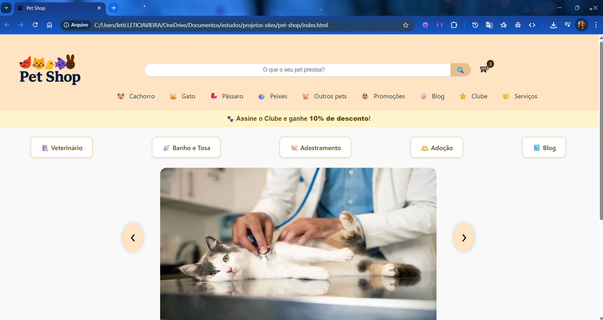

# Pet Shop Online

Desenvolvi um projeto de um pet shop online, onde testei algumas ferramentas que são comuns em sites dessa categoria.

## Tecnologias Utilizadas

- HTML5
- CSS3
- JavaScript (puro)

## Demonstração



> Em breve disponível online via GitHub Pages:
**https://aleticiavieira.github.io/petshop-site/**

**Acesse o site online:**  
[https://aleticiavieira.github.io/petshop-site/](https://aleticiavieira.github.io/petshop-site/)

## Funcionalidades

- Menu com categorias por tipo de pet
- Submenus com hover
- Carrossel de promoções automático
- Destaques de serviços e benefícios
- Rodapé com informações de pagamento, redes sociais e selos
- Carrinho de compras

## 🚀 Como rodar localmente

1. Clone este repositório:
```bash
git clone https://github.com/ALeticiaVieira/petshop-site.git
